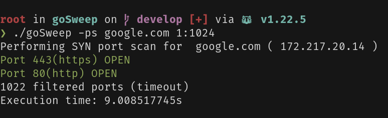
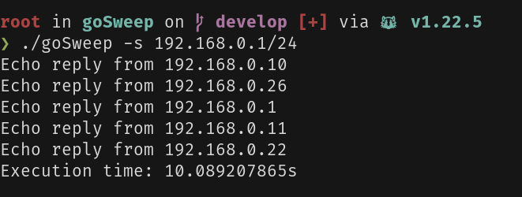

# goSweep

> [!CAUTION]
> Remember to use responsibly. Let's not accidently cause a network meltdown, shall we?

goSweep is a command-line tool written in Go for network scanning that includes features like SYN/stealth port scanning and ping sweeping.

## Features

- **TCP Port Scanning**: Concurrently performs SYN/stealth scans, which are the most efficient as they do not complete the TCP handshake.
- **Ping sweeping**: Quickly detect live hosts within a specified network range.

## Installation

To install goSweep, make sure you have Go installed and set up on your machine. Then:
``` sh
go get github.com/murrrda/goSweep
```
or
``` sh
git clone https://github.com/murrrda/goSweep.git
cd goSweep
go build -o goSweep cmd/goSweep/main.go
```

## Usage

### Port scanning (-ps)

To perform a port scan (requires root privileges):
``` sh
./goSweep -ps <host> <port-range>
```
- **\<host\>**: The IP address or hostname of the target.
- **\<port-range\>**: The range of ports to scan (e.g., **1:1024**).

Example:
``` sh
./goSweep -ps scanme.nmap.org 1:80
```

### Ping sweeping (-s)

To perform ping sweep, use the following command:
``` sh
./goSweep -s <network>
```
- **\<network\>**: The IP range to sweep (e.g., 192.168.1.0/24). Note: network must be provided in CIDR notation

Example:
``` sh
./goSweep -s 192.168.0.1/24
```

## Example output

#### Port scanning



#### Ping sweep

