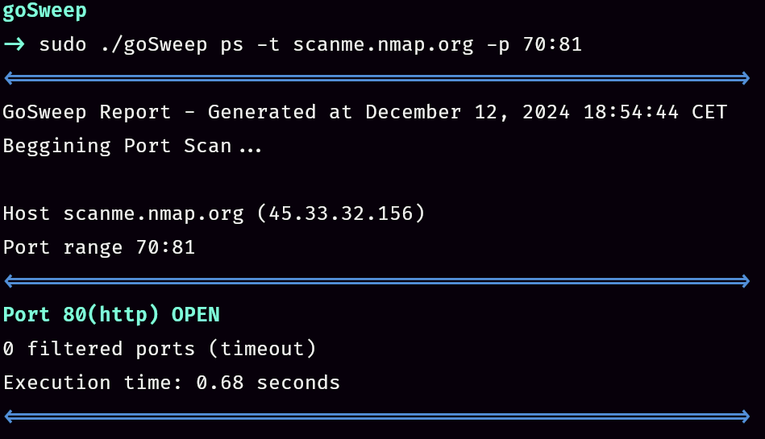
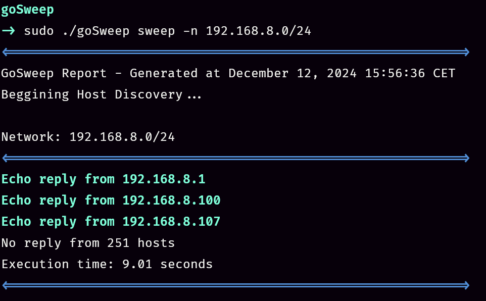
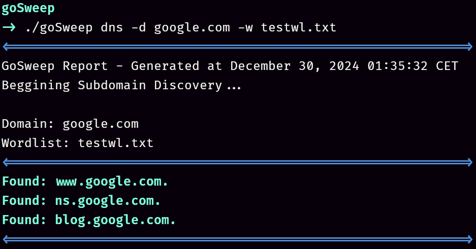
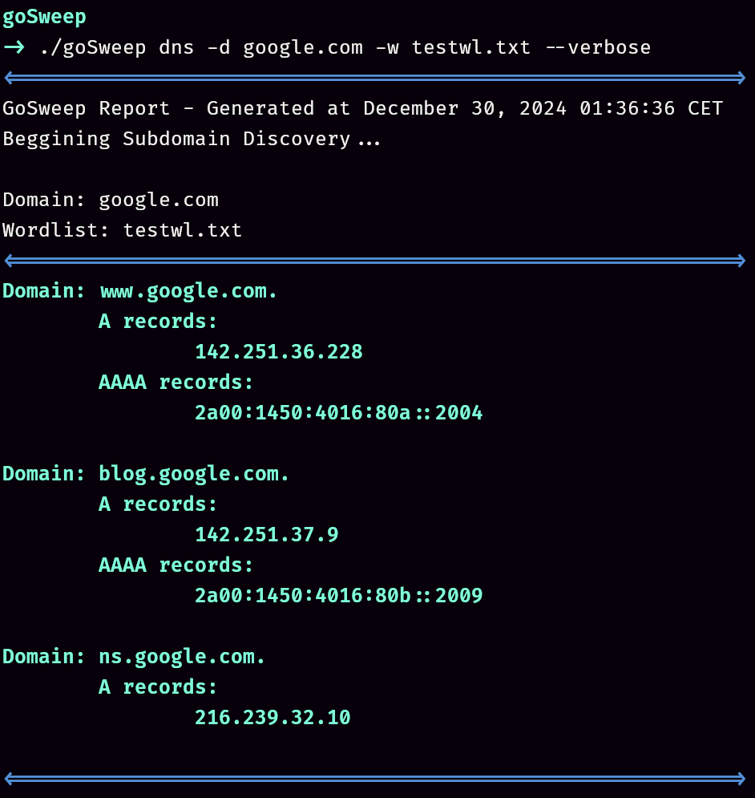
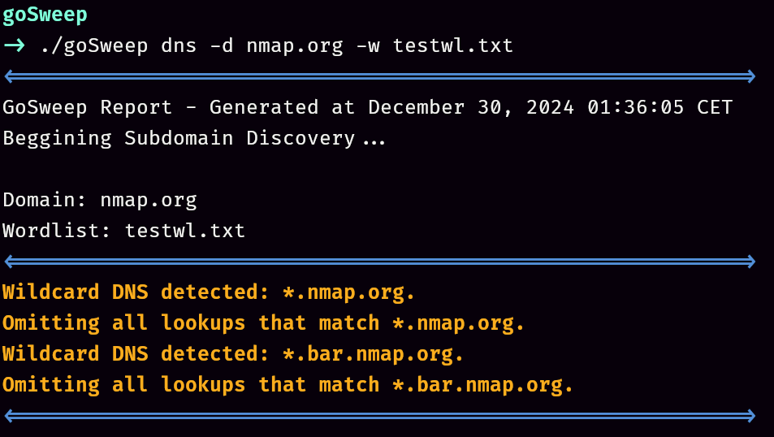

# goSweep 🧹

[](https://goreportcard.com/report/github.com/murrrda/goSweep)

> [!CAUTION]
> Remember to use responsibly. Let's not accidentally cause a network meltdown, shall we?

GoSweep is a command-line tool written in Go for network scanning.\
_Note: this tool has not been heavily tested and is not intended (yet) for professional use._

## Table of Contents

- [Features](#features)
- [Installation](#installation)
- [Usage](#usage)
  - [Port Scanning (ps)](#port-scanning)
  - [Ping Sweeping (sweep)](#ping-sweeping)
  - [DNS Subdomain Enumeration](#dns-subdomain-enumeration)
- [Next steps](#next-steps)
- [Contributing](#contributing)

## Features

- **TCP Port Scanning**: Concurrently performs SYN (stealth) scan
- **DNS subdomain enumeration**: Wordlist-based brute-force subdomain discovery with wildcard support
- **Ping sweeping (host discovery)**: Detect live hosts within a specified network range using ICMP

## Installation

### Install via `go install`

To install `goSweep`, run the following command:

```sh
go install github.com/murrrda/goSweep/cmd/goSweep@latest
```

This will install the `goSweep` binary to your `$GOPATH/bin` (or `$HOME/go/bin`).

<br/>

### Docker

You can pull a prebuilt Docker image from Docker Hub:

```sh
docker pull aleksamrda/gosweep
```

When using the DNS feature, you will need to mount your wordlist file to the container. For example: `-v /path/to/wordlist.txt:/app/wordlist.txt`

<br/>

### Build from source

To install goSweep, make sure you have Go installed and set up on your machine. Then:

```sh
git clone https://github.com/murrrda/goSweep.git
cd goSweep
go build -ldflags="-s -w" -o goSweep cmd/goSweep/main.go
```


## Usage

GoSweep uses a subcommand-based structure, where the primary command (`goSweep`) is followed by a specific subcommand (e.g., `ps`, `dns`, `sweep`) to perform different actions. Each subcommand has its own options for detailed control. Check `./goSweep -h` for more information.\
**Please use --no-color flag when piping output to files**

### Port scanning

To perform a port scan (**requires root privileges**):

```sh
./goSweep ps --target domain --port-range range
```

- **--target, -t**: The IP address or domain of the target.
- **--port-range, -p**: The range of ports to scan (e.g., **1:1024**).

Note: does not work on Windows yet.



<br>

### Ping sweeping

To perform ping sweep (**requires root privileges**):

```sh
./goSweep sweep --network network
```

- **--network, -n**: The IP range to sweep (e.g., 192.168.1.0/24). **Note**: network must be provided in CIDR notation



### DNS subdomain enumeration

To perform subdomain enumeration you will need wordlist. Check [SecLists lists](https://github.com/danielmiessler/SecLists/tree/master/Discovery/DNS)

```sh
./goSweep dns --domain domain --wordlist /path/to/wordlist.txt
```

- **--domain, -d**: The domain of the target
- **--wordlist, -w**: Path to newline separated file of subdomains



Use verbose flag for detailed output



Wildcard detection



## Next steps

- [ ] Implement port scan support for Windows
- [ ] Add CLI flag to allow users to provide a custom list of DNS servers for subdomain enumeration

## Contributing

Your feedback is valuable! If you encounter a bug, have questions, or want to suggest a feature, please open an issue on the repository.

When raising an issue, please provide:

- A clear description of the problem or idea.
- Steps to reproduce (if reporting a bug).
- Any other relevant details, such as logs or screenshots.

Thank you for helping improve this tool!
